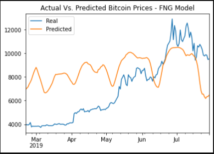
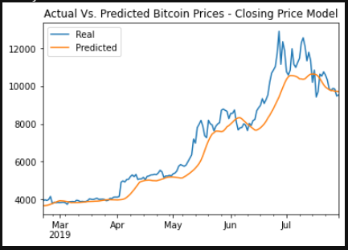

# Unit 14 Homework - LSTM Crypto 
### Gregory Terrinoni

#### *Which model has a lower loss?*

The closing price model had the lower loss.  On a rolling window of 10, in my 4 layer model with 60 epochs and a 10 batch size closing prices had a .00892 and the FNG model had a whopping .0847.
Closing price:

#### Which model tracks the actual values better over time?*

The closing price model is far superior at tracking prices over time, which could be infered by the loss score from question 1.

#### Which window size works best for the model?

The Closing price model performs slightly better with a shorter rolling window (5-days) and gets worse the longer you make the window.  

For the FNG model, 10 days seems to be the sweet spot as the loss gets marginally worse at a shorter(5-days) and longer (20+ days) rolling windows.